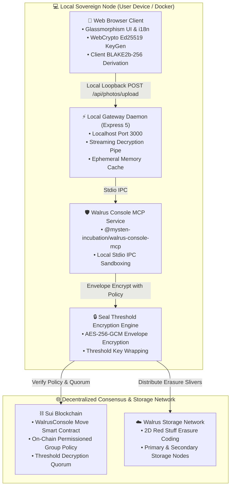

# 🌊 Nodus — Sovereign Cloud & Private Storage

> **A consumer-grade, privacy-first programmable private cloud alternative to Google Drive, Photos, and Apple iCloud, powered by the Walrus Protocol and the Sui blockchain.**

[](https://sui.io)
[](https://walrus.xyz)
[](https://github.com/MystenLabs)
[](https://docker.com)
[](LICENSE)

---

## 🚨 Obrigatório agora — caminho crítico da banca

Esta tabela é o painel público de execução do time. Ela resume o caminho crítico;
o detalhamento e os critérios de aceite continuam em [`pending_milestones.md`](pending_milestones.md).

| # | Entrega obrigatória | Estado atual | Evidência que falta para concluir |
| --- | --- | --- | --- |
| 1 | Prova Solana Devnet (M7): programa, PDAs e transações reais | Código e provisionador prontos | Deploy Devnet, assinaturas e links do Explorer |
| 2 | SIWS conectado ao RBAC on-chain (M7) | Backend fail-closed pronto | Login Phantom/Solflare real com prova exibida |
| 3 | Happy path privado Walrus (M0/M1) | Fluxos implementados | Upload/download real em Testnet com Blob no Explorer |
| 4 | Colaboração soberana mínima (M5) | **Em desenvolvimento nesta branch** | Duas wallets, envelope, expiração e revogação demonstráveis |
| 5 | Produto apresentável (M9) | Referência visual disponível | Landing e telas críticas conectadas ao runtime real |
| 6 | Roteiro e evidências | Em preparação | Passada gravável de 5–7 minutos sem segredos no repositório |

> **Limite de revogação:** revogar bloqueia leituras futuras de envelopes pelo
> Nodus. Não apaga cópias ou chaves que o destinatário já tenha decifrado e
> exportado localmente.

### Desenvolvimento local sem credenciais de rede

`npm run test:collaboration:local` inicia um PostgreSQL descartável, provisiona a organização de demonstração de forma idempotente e executa os fluxos completos de envelope, share e revogação. Não requer `.env`, Solana ou Walrus. Consulte [`docs/LOCAL_TESTS_AND_PROVISIONING.md`](docs/LOCAL_TESTS_AND_PROVISIONING.md).

Materiais da apresentação: [`docs/DEMO_ROTEIRO_5_MIN.md`](docs/DEMO_ROTEIRO_5_MIN.md) e [`docs/DEMO_SLIDE_ARQUITETURA.md`](docs/DEMO_SLIDE_ARQUITETURA.md).

---

## 📸 Overview

**Nodus** gives users full cryptographic sovereignty over their personal media and documents. Traditional cloud storage providers inspect private files to train commercial machine-learning models, build advertising profiles, or lock accounts arbitrarily. Nodus reclaims user ownership:

- 🔒 **Threshold Envelope Encryption (Seal)**: Media is sealed via AES-256-GCM envelope encryption wrapped against on-chain Sui policies before raw slivers are distributed across the Walrus decentralized network.
- 🌊 **Decentralized Fountain Erasure Coding (Walrus)**: Files are split into 2D Red Stuff erasure-coded slivers distributed across independent storage nodes, cutting redundancy storage costs compared to traditional cloud infrastructure (AWS S3 / Google Cloud).
- ⚡ **Non-Blocking Background Uploads**: Continue browsing your gallery, viewing high-resolution Lightbox media, and editing tags while uploads process in a bottom-docked upload manager.
- 🔑 **Sovereign Cryptographic Identity**: 100% in-browser Ed25519 keypair generation via the standard WebCrypto API, with zero server exposure, backed by Sui on-chain Move access policies.
- 🔍 **Dual Explorer Verification**: 1-click on-chain verification of raw storage slivers on **Walruscan** and threshold access policies on **SuiVision** and **SuiScan**.
- 🌐 **3-Language Localization**: Native internationalization in 🇺🇸 English, 🇪🇸 Español, and 🇧🇷 Português.

---

## 🏛️ System Architecture



---

## ✨ Features

1. **Optimistic Timeline & Background Dock**:
   - Uploaded photos appear immediately in your timeline with live preview, pulsing Sui-blue progress rings, and real-time stage badges (`1. Seal Encryption` ➔ `2. Walrus Blob Store` ➔ `3. Anchored`).
   - Pinned collapsible floating upload dock in the bottom-right corner.

2. **Decrypted Streaming & Provenance Inspector**:
   - Stream original high-resolution photos bit-for-bit decrypted on the fly.
   - Lightbox inspector displaying **Walrus Blob ID**, **Console File ID**, **Seal Encryption Policy**, byte size, and timestamps.
   - Direct external links to inspect storage certification on [Walruscan](https://walruscan.com/testnet), and live on-chain policy objects on [SuiVision](https://suivision.xyz) and [SuiScan](https://suiscan.xyz).

3. **Vault Identity & On-Device WebCrypto**:
   - Switch between Master Custodian and Ephemeral Beta Tester Vaults.
   - 1-click in-browser generation of cryptographic Ed25519 keypairs and derived `0x...` Sui addresses using standard `window.crypto.subtle` (zero server transmission).

4. **Dynamic Tag Filtering & Batch Actions**:
   - Instant filtering chips (`All`, `crypto`, `photo`, `nodus`, etc.) and multi-criteria sorting (Newest, Oldest, Name A-Z, Size).
   - Floating batch selection bar with bulk download and batch deletion.

5. **Irreversible Crypto-Shredding**:
   - Enforces digital right-to-be-forgotten via **Crypto-Shredding** (aligned with NIST SP 800-88 cryptographic sanitization guidelines): deleting an asset revokes access to the decryption policy keys, mathematically rendering remaining distributed ciphertext slivers permanently unrecoverable across all storage nodes.

6. **Solana Identity & Anchor Program Derived Addresses (PDAs)**:
   - **Sign-In With Solana (SIWS)**: Challenge-response authentication via detached Ed25519 signatures, supporting Phantom, Solflare, or keypairs alongside Sui and Google zkLogin.
   - **Anchor Org & Member PDAs**: Deterministic, verifiable organizational trees (`["nodus_org", orgId]` and `["nodus_member", orgPDA, memberPubkey]`) providing cross-chain role-based access control (`owner`, `admin`, `contributor`, `viewer`).
   - **Cross-Chain Cohesion**: Authenticate with Solana, govern team permissions with Anchor PDAs, and store client-side encrypted blobs on Walrus secured by Sui Seal threshold policies.

---

## 🚀 Quickstart

### Prerequisites
- [Docker](https://www.docker.com/) & Docker Compose (or Node.js 20+)
- Walrus Console API credentials

### 1. Clone & Configure
```bash
git clone https://github.com/samuelcampozano/nodus.git
cd nodus

# Copy environment template
cp .env.example .env
```

Add your Walrus Console credentials in `.env`:
```env
CONSOLE_API_KEY=hbr_your_api_key_here
CONSOLE_SERVICE_PRIVATE_KEY=suiprivkey1_your_private_key_here
CONSOLE_WEB_ACCOUNT_ADDRESS=0x_your_owner_address_here
CONSOLE_API_BASE_URL=https://api.console.walrus.xyz
CONSOLE_MCP_ALLOWED_DIRS=/app
```

### 2. Run with Docker Compose
```bash
docker compose up -d --build
```
Open **[http://localhost:3000](http://localhost:3000)** in your browser.

### 3. Local Development (Without Docker)
```bash
npm install
npm run dev
```

### 4. Run Automated Test Suites
Run the automated test suites verifying backend security defenses, API endpoints, zero-plaintext privacy, developer SDK, private search, on-chain Sui Mainnet policies, crypto-shredding, Solana identity, and resumable direct publisher:
```bash
# Run all 15 test suites end-to-end
npm test

# Run individual suites
npm run test:security       # Magic bytes validation, path traversal defense, XSS escaping, cache TTL
npm run test:api            # REST endpoints, rate limiting, and HTTP security headers
npm run test:zero-plaintext # Validates zero plaintext disk/memory leaks, enforces ciphertext, 404 on wallet endpoint
npm run test:m0-zero-custody # Enforces strict zero-custody boundaries on upload routes
npm run test:resumable      # Resumable encrypted multipart upload and chunk assembly
npm run test:direct-publisher # Authenticated direct publisher stream and HMAC receipts
npm run test:key-envelopes  # Client-side ECDH P-256 key envelopes & emergency account recovery
npm run test:tenant-provisioning # Atomic tenant, storage context, and operator provisioning
npm run test:web-zero-custody # In-browser zero-custody WebCrypto verification
npm run test:sdk            # Developer SDK operations: put, get, private search, and crypto-shredding
npm run test:onchain        # Sui Mainnet GraphQL Move policy and custodian verification
npm run test:shred          # End-to-end live crypto-shredding and bit-for-bit validation
npm run test:solana         # Sign-In With Solana (SIWS), Anchor PDAs, and cross-chain cohesion
```

---

## 📦 Developer SDK (`@nodus/sdk`)

Nodus provides an isomorphic TypeScript/ESM SDK for developers building decentralized applications on Walrus with zero cryptographic complexity:

```javascript
import { createNodusClient } from "nodus-vault/sdk";

// Initialize client (defaults to localhost:3000)
const nodus = createNodusClient({ gatewayUrl: "http://localhost:3000" });

// 1. Client-Side Encrypt & Anchor Asset (PDF, DOCX, Images, Video)
const upload = await nodus.put(fileBuffer, {
  name: "confidential_contract.pdf",
  type: "application/pdf",
  description: "Signed Partnership Agreement",
  tags: ["legal", "partnerships"],
  encrypt: true // Encrypts client-side with AES-256-GCM before transport
});
console.log(`Anchored on Walrus Blob: ${upload.blob_id}`);

// Files above 20 MiB automatically use encrypted resumable upload.
// A Blob/File is read and encrypted one chunk at a time, so the entire file
// is never loaded into browser memory.
const largeUpload = await nodus.put(largeVideoFile, {
  name: "project-archive.mp4",
  type: "video/mp4",
  chunkSize: 8 * 1024 * 1024,
  onProgress: ({ uploadedBytes, totalBytes }) => {
    console.log(`${Math.round((uploadedBytes / totalBytes) * 100)}% uploaded`);
  }
});

// 2. Zero-Knowledge Private Search (100% on-device, zero cloud queries)
const results = await nodus.search("contract", { type: "application/pdf" });

// 3. Bit-for-Bit Decrypted Stream
const asset = await nodus.get(upload.id);
// asset.data contains decrypted Uint8Array bytes

// 4. Verifiable Crypto-Shredding
await nodus.delete(upload.id);

// 5. Cross-Chain Solana Authentication & Anchor Organization PDAs
const challenge = await nodus.getSolanaChallenge("9WzDXwBbmkg8ZTbNMqUxvQRAyrZzDsGYdLVL9zYtAWWM");
// Sign challenge.message with Phantom / Solflare / Ed25519 keypair...
const session = await nodus.verifySolanaAuth("9WzDXwBbmkg8ZTbNMqUxvQRAyrZzDsGYdLVL9zYtAWWM", signatureBase58, challenge.message, "acme-corp");

// 6. Anchor Multi-Tenant Organization Management
const org = await nodus.createOrganization({
  orgId: "acme-corp",
  name: "Acme Corporation",
  ownerAddress: "9WzDXwBbmkg8ZTbNMqUxvQRAyrZzDsGYdLVL9zYtAWWM"
});
console.log(`Anchor Org PDA: ${org.orgPda}`);
```

In a production tenant deployment, `verifySolanaAuth` returns a short-lived `accessToken` after the address is verified as a member of the selected pre-provisioned organization. The SDK retains that token for subsequent asset, upload, manifest, and deletion requests; do not persist it in browser local storage. Configure `POSTGRES_PASSWORD` and `DATABASE_URL` only in an untracked `.env` file, then apply migrations `001_auth_tenants.sql` through `006_tenant_provisioning.sql` before enabling tenant uploads. The control plane reserves quota before an upload, binds it to the authenticated user and organization, and converts the reservation to used storage only after finalization.

The API refuses tenant endpoints when no tenant store is configured. A local-only compatibility bypass requires `NODUS_ALLOW_INSECURE_DEV_AUTH=true`; never set it outside a disposable development environment.

Tenant organizations are provisioned by the separate operator plane, never by a browser session. Set `NODUS_PROVISIONING_ADMIN_TOKEN` in the secret manager and follow [the provisioning runbook](docs/TENANT_PROVISIONING_RUNBOOK.md). When a managed storage account is available, configure `NODUS_TENANT_PROVISIONER_URL` and its token; otherwise an operator must supply the existing `spaceId`, `bucketId`, and `sealPolicyId` to the protected provisioning API.

Tenant organizations are provisioned by the separate operator plane, never by a browser session. Set `NODUS_PROVISIONING_ADMIN_TOKEN` in the secret manager and follow [the provisioning runbook](docs/TENANT_PROVISIONING_RUNBOOK.md). When a managed storage account is available, configure `NODUS_TENANT_PROVISIONER_URL` and its token; otherwise an operator must supply the existing `spaceId`, `bucketId`, and `sealPolicyId` to the protected provisioning API.

Set `NODUS_ALLOWED_ORIGINS` to the comma-separated HTTPS origins of the browser applications allowed to call the API. Production rejects all cross-origin browser requests when this value is absent.

---

## 🧪 API Reference

| Method | Endpoint | Description |
| :--- | :--- | :--- |
| `GET` | `/api/status` | Space quota, bucket metadata, and Seal policy |
| `GET` | `/api/photos` or `/api/assets` | List all assets anchored in the bucket with encryption metadata |
| `POST` | `/api/photos/upload` or `/api/assets/upload` | Ingest client-encrypted AES-256-GCM ciphertext payload |
| `POST` | `/api/assets/uploads` | Create an encrypted resumable-upload session (up to 500 GiB) |
| `GET` | `/api/assets/uploads/:uploadId` | Read received and missing parts to resume a session |
| `PUT` | `/api/assets/uploads/:uploadId/parts/:partNumber` | Upload one ciphertext part with `x-part-sha256` checksum |
| `POST` | `/api/assets/uploads/:uploadId/complete` | Assemble, verify and anchor every uploaded part |
| `DELETE` | `/api/assets/uploads/:uploadId` | Abort an upload and remove staged ciphertext |
| `GET` | `/api/photos/:id/stream` or `/api/assets/:id/stream` | Stream ciphertext blob with decryption headers (`x-nodus-encrypted`) |
| `PATCH` | `/api/photos/:id` or `/api/assets/:id` | Update asset name, caption, and tags |
| `DELETE`| `/api/photos/:id` or `/api/assets/:id` | Delete asset and trigger crypto-shredding |
| `POST` | `/api/photos/batch-delete` or `/api/assets/batch-delete` | Batch multi-asset deletion |
| `POST` | `/api/auth/solana/challenge` | Issue SIWS cryptographic challenge with 5-min TTL and replay protection |
| `POST` | `/api/auth/solana/verify` | Verify Ed25519 detached signature and issue cross-chain session |
| `POST` | `/api/auth/solana/demo` | Generate instant ephemeral Solana keypair session for zero-env testing |
| `GET` | `/api/orgs` | List user organizations or default Anchor team |
| `POST` | `/api/orgs` | Create organization and derive canonical Anchor Org PDA (`["nodus_org", orgId]`) |
| `GET` | `/api/orgs/:orgId` | Fetch organization details, member count, and Anchor PDA proof |
| `POST` | `/api/orgs/:orgId/members` | Add/update member role with Member PDA (`["nodus_member", orgPDA, memberPubkey]`) |
| `DELETE`| `/api/orgs/:orgId/members/:memberAddress` | Remove member from organization and revoke access |

---

## 🛡️ Security & Zero-Knowledge Architecture

- **Zero Plaintext Server Ingestion (Phase 0 Zero-Knowledge)**: Files are encrypted directly inside the client's browser memory via the standard WebCrypto API (AES-256-GCM) prior to network transmission. Zero bytes of plaintext ever reach the server disk, memory, or Walrus storage network. The backend validates and rejects any raw unencrypted file signatures.
- **Local Sovereign Gateway**: The application operates as a self-hosted sovereign node on the user's device (`localhost:3000` / local container). Unencrypted photos are never routed through cloud intermediaries.
- **Seal Threshold Encryption**: Media is encrypted using AES-256-GCM envelope encryption. Decryption keys are governed by threshold policies anchored to the Sui blockchain, preventing single-point key exposure.
- **No Master Key Custody**: Decentralized storage node operators and protocol developers hold no master keys. Key recovery requires threshold consensus verification against Move smart contracts.
- **On-Device Cryptographic Key Generation**: Ephemeral vault identities and AES keys are generated directly inside the user's browser memory via the standard WebCrypto API, eliminating server-side key custody risks.
- **Edge-First Local Compute**: Search indexing, metadata extraction, and facial clustering run locally on-device (client-side WebAssembly / WebGPU), ensuring sensitive biometric vectors or telemetry are never centralized.

### Resumable uploads

The gateway supports encrypted multipart sessions for files from 1 byte up to 500 GiB. The SDK uses this legacy protocol only when explicitly selected or below 20 MiB; each part is encrypted independently with AES-256-GCM, checksum-verified by the gateway, persisted to a session directory, and can be retried without re-uploading prior parts. A session expires after 24 hours if it is not completed.

The legacy resumable route assembles ciphertext sequentially on local disk before passing it to the Walrus adapter. For production-scale workloads, the SDK automatically selects the direct authenticated publisher flow above 20 MiB (set `directPublisher: false` only for a controlled legacy migration). The gateway becomes a control plane: it issues a short-lived, one-time JWT per encrypted segment and stores canonical session/manifest metadata in PostgreSQL. Ciphertext is sent from the browser directly to the configured Walrus publisher and never passes through the Nodus server.

```js
const upload = await nodus.put(largeVideoFile, {
  name: "archive.mp4",
  type: "video/mp4",
  chunkSize: 8 * 1024 * 1024,
  segmentSize: 64 * 1024 * 1024,
  concurrency: 3,
  maxRetries: 4,
  epochs: 2
});
```

Each segment becomes one Walrus blob; Nodus returns a logical asset plus an ordered manifest. This is required for files larger than a single Walrus blob. The SDK hashes one deterministic encryption pass and streams a second one to the publisher, avoiding any in-memory ciphertext segment allocation. The manifest and every AES-GCM ciphertext chunk carry a SHA-256 integrity check that is verified before decryption. `nodus.stream(assetId, { range: "bytes=0-1048575" })` supports authenticated plaintext ranges for media players and seekable downloads. The AES key stays with the client and is never sent to the control plane or stored in the manifest. Configure `NODUS_PUBLISHER_URL`, `NODUS_PUBLISHER_JWT_SECRET`, and a distinct `NODUS_PUBLISHER_RECEIPT_SECRET` before enabling this option outside tests. The publisher must consume each JWT `jti` exactly once and return an HMAC-SHA256 signed receipt binding the `jti`, upload ID, segment index, ciphertext SHA-256, ciphertext size, and Walrus blob ID; Nodus refuses to finalize an asset without verified receipts for every segment.

For product UIs, pass a `NodusUploadControl` through upload options. It pauses or cancels work safely; the SDK stores only a session reference in browser storage so an unfinished upload can be discovered after reopening the browser. The data key remains device-local or is recovered through its encrypted owner/recovery envelope.

### Recipient envelopes and account recovery

After Solana sign-in, create one client-side encryption identity. Nodus registers only the P-256 public keys. Every asset key is then wrapped locally using ephemeral ECDH P-256 plus AES-256-GCM for the owner, recipients, and (optionally) their recovery keys. The gateway stores only these ciphertext envelopes and cannot unwrap them.

```js
const { identity, recoveryKit } = await nodus.bootstrapKeyIdentity({
  passphrase: "a long recovery passphrase"
});

const upload = await nodus.put(file, { name: "plan.pdf", type: "application/pdf" });
await nodus.protectAssetKey(upload.id, { recipientAddresses: [teammateSolanaAddress] });
await nodus.protectAssetKey(upload.id, { organizationId: "acme-corp" });

// On a new device, after authenticating the same Solana identity:
const keyHex = await nodus.recoverAssetKey(upload.id, { recoveryKit, passphrase: "a long recovery passphrase" });
```

Store the encrypted `recoveryKit` with the user (download, password manager, or another trusted vault), never in the Nodus gateway. Removing a member blocks future envelope fan-out; re-encrypt existing assets when immediate revocation is required. **Revocation cannot delete a plaintext copy that a recipient has already decrypted, downloaded, exported, or screen-captured.** It prevents future recovery through Nodus only after the old ciphertext is re-encrypted and its old envelopes are destroyed.

---

## 📄 License
This project is licensed under the MIT License - see the [LICENSE](LICENSE) file for details.
