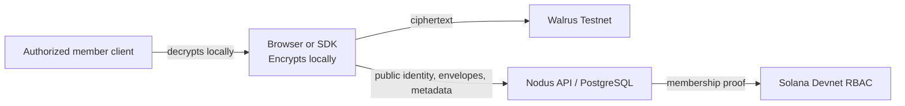

# Nodus — Private Data Layer for Verifiable Collaboration

> **Nodus is a zero-custody private data layer for applications that need to store, share, revoke, and verify encrypted data without giving the platform the decryption keys.**

[](https://walrus.xyz)
[](https://solana.com)
[](https://docker.com)
[](LICENSE)

## What Nodus is

Nodus is not a conventional file host. It is a control plane and developer API for private data:

- The client encrypts data before upload.
- Walrus stores ciphertext, not plaintext.
- Nodus stores tenant metadata, encrypted key envelopes, audit records, and access grants.
- Solana Devnet PDAs provide verifiable organization and role proofs for the demo.
- The client, not Nodus, holds the asset data key.

The current project is optimized for a verifiable Testnet/Devnet demonstration: an Owner uploads encrypted data, shares access with a Member, the Member opens it through an encrypted envelope, and future envelope reads are blocked after revocation.

## Trust model



Nodus never needs an asset's AES data key. The server receives public key material and ciphertext envelopes only.

**Important revocation limit:** revocation prevents future envelope retrieval through Nodus. It cannot erase a plaintext copy, screenshot, export, or key that a recipient already decrypted locally.

## Current demo scope

The demo focuses on these proof points:

1. Client-side encryption and ciphertext storage on Walrus Testnet.
2. Organization membership and role proof through Solana Devnet.
3. Tenant-isolated metadata, key envelopes, and access grants in PostgreSQL.
4. Owner-to-Member sharing with a client-generated ECDH P-256 envelope.
5. Revocation that blocks a new envelope read.

Public demo evidence, when available, is kept in [`docs/HACKATHON_EVIDENCIAS.md`](docs/HACKATHON_EVIDENCIAS.md). The execution checklist is in [`docs/HACKATHON_4_DIAS_EXECUCAO.md`](docs/HACKATHON_4_DIAS_EXECUCAO.md).

## Architecture

| Layer | Responsibility | What it must not hold |
| --- | --- | --- |
| Browser / SDK | Encrypts data, creates and opens envelopes, decrypts locally | Other users' private keys |
| Nodus API | Authenticates sessions/API keys, enforces tenant scope, stores metadata and encrypted envelopes | Asset plaintext or data keys |
| PostgreSQL | Organizations, memberships, catalog, audit events, envelopes, grants, idempotency records | Plaintext file content |
| Walrus | Ciphertext blob storage | Decryption keys |
| Solana | Devnet organization, membership, and capability proofs | File content or encryption keys |

## Quick start

### Prerequisites

- Node.js 20+
- Docker Desktop with Docker Compose (recommended for PostgreSQL)
- Walrus Testnet credentials for a live upload
- Solana Devnet wallets and deployed Program ID for the full collaboration demo

### 1. Clone and configure

```bash
git clone https://github.com/samuelcampozano/nodus.git
cd nodus
cp .env.example .env
```

`.env` is private. Do not commit it. At minimum, configure the values required by your chosen mode:

```env
# Isolated demo environment
NODUS_DEPLOYMENT_ENV=sandbox
WALRUS_DIRECT_TESTNET_ENABLED=true

# Walrus Console credentials — use either a bundle or individual values
CONSOLE_API_KEY=hbr_...
CONSOLE_SERVICE_PRIVATE_KEY=suiprivkey1...
CONSOLE_WEB_ACCOUNT_ADDRESS=0x...

# Solana Devnet RBAC for the live demo
SOLANA_PROGRAM_ID=YOUR_DEPLOYED_DEVNET_PROGRAM_ID
SOLANA_DEVNET_RPC_URL=https://api.devnet.solana.com
NODUS_SOLANA_RBAC_MODE=devnet

# Keep publisher secrets distinct in real environments
NODUS_PUBLISHER_JWT_SECRET=...
NODUS_PUBLISHER_RECEIPT_SECRET=...
```

Run the configuration gate before a live demonstration:

```bash
npm ci
npm run demo:preflight
```

### 2. Run the stack

```bash
docker compose up -d --build
```

Open [http://localhost:3000](http://localhost:3000).

To stop it:

```bash
docker compose down
```

For API-only development without Docker, install dependencies and run:

```bash
npm ci
npm start
```

`npm start` does not create PostgreSQL for you. Tenant, envelope, and collaboration routes require `DATABASE_URL`.

## Local collaboration validation

The disposable collaboration suite needs no Walrus or Solana credentials. It starts a temporary PostgreSQL 16 instance, provisions `demo-org` twice, and verifies tenant isolation, envelopes, grants, expiry, revocation, and re-share behavior.

```bash
npm run test:collaboration:local:check
npm run test:collaboration:local
```

The runner writes an ignored, local report to `scratch/local-collaboration-report.json`. See [`docs/LOCAL_TESTS_AND_PROVISIONING.md`](docs/LOCAL_TESTS_AND_PROVISIONING.md).

## Running the live demo flow

The full flow uses local, ignored demo wallets and records only public evidence in `scratch/`.

```bash
# Upload an encrypted demo asset after the API, PostgreSQL, Walrus credentials,
# and Owner wallet are ready.
node scripts/execute-demo-upload.mjs

# Authenticate Owner and Member, create the Member envelope, grant viewer,
# revoke it, and verify that a new envelope read is denied.
npm run demo:collaboration
```

The second command requires `.demo-wallets/owner.json`, `.demo-wallets/member.json`, and `scratch/demo_uploaded_asset.json`. These files are intentionally ignored by Git. Solana capability revocation is a separate on-chain action and must be recorded with its Explorer transaction link.

## API access and credentials

### Session bearer tokens

Interactive users authenticate by Sign-In With Solana (SIWS):

1. `POST /api/auth/solana/challenge`
2. Sign the returned message with a Solana wallet.
3. `POST /api/auth/solana/verify`
4. Send the returned short-lived bearer token on subsequent calls.

```http
Authorization: Bearer <session-token>
```

The session determines the active organization, storage context, and role. Do not put session tokens in local storage; keep them in memory or session storage only.

### Organization API keys

Owners and admins can create scoped API keys through the protected organization endpoints:

```text
POST   /api/orgs/:orgId/api-keys
GET    /api/orgs/:orgId/api-keys
POST   /api/orgs/:orgId/api-keys/:apiKeyId/rotate
DELETE /api/orgs/:orgId/api-keys/:apiKeyId
```

Supported initial scopes are:

```text
assets:read, assets:write, assets:delete, assets:share, search:read, audit:read
```

The plaintext API key is returned once at creation or rotation. Nodus stores only its hash. Integrators send it as a bearer token and should use `Idempotency-Key` for retried writes.

```http
Authorization: Bearer <nodus-api-key>
Idempotency-Key: <unique-client-generated-value>
```

### Provisioning a tenant

Tenant creation is an operator action, not a browser action. Keep `NODUS_PROVISIONING_ADMIN_TOKEN` in a secret manager and follow [`docs/TENANT_PROVISIONING_RUNBOOK.md`](docs/TENANT_PROVISIONING_RUNBOOK.md). A tenant needs an organization, owner membership, storage context (`space`, `bucket`, `seal policy`), and quota before authenticated uploads are enabled.

### Production hardening

- Set `NODUS_ALLOWED_ORIGINS` to explicit HTTPS browser origins.
- Use separate databases, API keys, webhook secrets, publisher credentials, and origins for sandbox and production.
- Set `NODUS_WEBHOOK_ENCRYPTION_KEY` before enabling signed webhooks.
- Never reuse the publisher JWT secret as the receipt verification secret.
- Never expose provisioning tokens, private keys, API keys, or `.env` files to a browser or repository.

## API overview

| Area | Examples |
| --- | --- |
| Status | `GET /api/status` |
| SIWS | `POST /api/auth/solana/challenge`, `POST /api/auth/solana/verify` |
| Assets | `GET /api/assets`, `POST /api/assets/upload`, `DELETE /api/assets/:id` |
| Envelopes | `POST/GET /api/assets/:assetId/key-envelopes` |
| Sharing | `POST/GET /api/assets/:assetId/shares`, `DELETE /api/assets/:assetId/shares/:grantId` |
| API keys | `POST /api/orgs/:orgId/api-keys`, rotation and revocation endpoints |
| Webhooks | organization webhook creation, rotation, delivery audit, and revocation endpoints |

The public contract and examples are in [`openapi/nodus.openapi.yaml`](openapi/nodus.openapi.yaml).

## SDK

```js
import { createNodusClient } from "nodus-vault/sdk";

const nodus = createNodusClient({ gatewayUrl: "http://localhost:3000" });

const challenge = await nodus.getSolanaChallenge(walletAddress);
// Sign challenge.message with the wallet, then:
await nodus.verifySolanaAuth(walletAddress, signatureBase58, challenge.message, "demo-org");

await nodus.bootstrapKeyIdentity(); // Registers public identity only
const upload = await nodus.put(file, { name: "private-plan.pdf", type: "application/pdf" });
const original = await nodus.get(upload.id); // Decrypts client-side
```

For large encrypted uploads, the SDK can use the authenticated direct publisher flow; ciphertext goes from the client to the publisher, while Nodus remains the authorization and metadata control plane.

## Verification and tests

```bash
npm test
npm run test:zero-plaintext
npm run test:key-envelopes
npm run test:asset-sharing
npm run test:walrus-fallback
npm run test:solana
```

Tests do not replace a real Devnet/Testnet demonstration. Record public Program IDs, PDAs, transaction signatures, Blob IDs, and Explorer links in [`docs/HACKATHON_EVIDENCIAS.md`](docs/HACKATHON_EVIDENCIAS.md).

## License

MIT. See [LICENSE](LICENSE).
