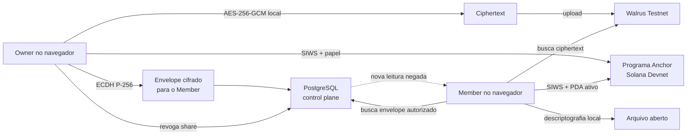

# Material do slide único — arquitetura da demo

## Título

**Nodus — arquivo privado, storage verificável, acesso revogável**

## Diagrama

## Três mensagens

1. **Zero plaintext no gateway:** arquivo e chave de dados permanecem cifrados fora do navegador.
2. **Provas públicas:** Blob ID no Walrus Testnet e papéis/PDA na Solana Devnet.
3. **Revogação honesta:** bloqueia envelopes futuros; não promete apagar cópias já abertas.

## Rodapé obrigatório

`Demo em Testnet/Devnet · Não é Mainnet · Sem alegação de SLA ou produção`

