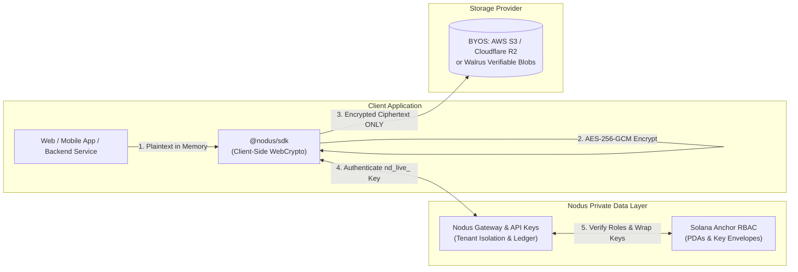

# Nodus B2B Secure Portal — 15-Minute Quickstart

> **The Private Data Layer for Apps and Teams.**
> Store and share sensitive documents, AI datasets, and media without building custom cryptography, key escrow, or access control from scratch.

---

## Architecture Overview



### Core Guarantees

1. **Zero-Plaintext Invariant**: Files are encrypted in memory on the client device. Plaintext never touches Nodus servers, proxies, or logs.
2. **Bring Your Own Storage (BYOS)**: Point ciphertext directly to your existing AWS S3 bucket, Cloudflare R2, or Walrus verifiable storage.
3. **On-Chain Role-Based Access Control (RBAC)**: Manage Admin, Member, and Viewer roles backed by Solana Anchor PDAs and cryptographic key envelopes.
4. **Transparent Cost Ledger**: Track logical storage, operations, and estimated monthly costs before finalizing writes.

---

## 15-Minute Integration Guide

### Step 1: Obtain Your API Key
1. Sign in to the Nodus Console at your deployment URL (or your local Docker instance at `http://localhost:3000`).
2. Navigate to **Developers & API Keys**.
3. Click **Generate API Key**, select the `assets:read` and `assets:write` scopes, and copy your secret key (`nd_live_...`).

### Step 2: Configure Environment

```bash
export NODUS_API_KEY="nd_live_your_secret_key_here"
export NODUS_GATEWAY_URL="https://your-nodus-deployment"
```

### Step 3: Run the Quickstart Script

```bash
node quickstart.mjs
```

### Code Example (TypeScript / Node.js)

```javascript
import { NodusCrypto, createNodusClient } from "@nodus/sdk";

// 1. Initialize client with your company API key
const nodus = createNodusClient({
  gatewayUrl: process.env.NODUS_GATEWAY_URL || "http://localhost:3000",
  apiKey: process.env.NODUS_API_KEY
});

// 2. Encrypt file in client memory (Zero Plaintext)
const fileBuffer = Buffer.from("CONFIDENTIAL_FINANCIAL_REPORT_Q3");
const encryption = await NodusCrypto.encryptBuffer(fileBuffer);

// 3. Upload ciphertext to Nodus (Pointed to S3 or Walrus)
const upload = await nodus.put(encryption.ciphertext, {
  name: "q3-financials.pdf.enc",
  type: "application/octet-stream",
  description: "Audited financial statements",
  tags: ["finance", "confidential"]
});

console.log("Uploaded Ciphertext Asset ID:", upload.id);

// 4. Decrypt in memory when authorized
const downloadedCiphertext = await nodus.get(upload.id);
const decryptedBuffer = await NodusCrypto.decryptBuffer(
  downloadedCiphertext,
  encryption.keyHex,
  encryption.ivHex
);

console.log("Decrypted Plaintext:", Buffer.from(decryptedBuffer).toString("utf8"));
```

---

## Unit Economics & Pricing

| Plan | Price | Included |
| :--- | :--- | :--- |
| **Builder BYOS** | R$ 99 / project / month | Client-side encryption engine, unlimited S3/R2 storage, 5 API keys, RBAC control plane. |
| **Design Partner** | R$ 499 / workspace / month | Dedicated Slack channel, custom onboarding, up to 10 team seats, 3 environments. |
| **Walrus Verify** | R$ 2.00 / GB / month | Add-on for decentralized, verifiable storage attestations via Walrus Protocol & Sui Move. |
